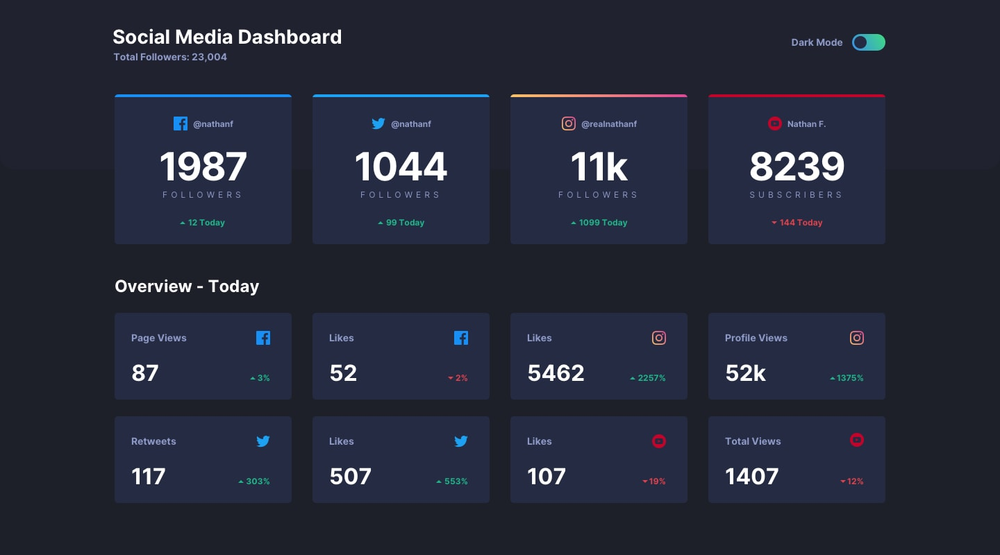

# Frontend Mentor - Social media dashboard with theme switcher solution

This is a solution to the [Social media dashboard with theme switcher challenge on Frontend Mentor](https://www.frontendmentor.io/challenges/social-media-dashboard-with-theme-switcher-6oY8ozp_H). Frontend Mentor challenges help you improve your coding skills by building realistic projects.

## Table of contents

- [Overview](#overview)
  - [The challenge](#the-challenge)
  - [Screenshot](#screenshot)
  - [Links](#links)
- [My process](#my-process)
  - [Built with](#built-with)
- [Author](#author)

## Overview

### The challenge

Users should be able to:

- View the optimal layout for the site depending on their device's screen size
- See hover states for all interactive elements on the page
- Toggle color theme to their preference

### Screenshot

### Links

- Live Site URL: [Live site here](https://Jalobig.github.io/social-media-dashboard-theme-switcher/)

## My process

### Built with

- Semantic HTML5 markup
- Sass custom properties
- Flexbox
- Desktop-first workflow
- [React](https://reactjs.org/) - JS library

## Author

- Website - [Jason Alexis](https://www.jason-alexis.vercel.app)
- Frontend Mentor - [@jalobog](https://www.frontendmentor.io/profile/jalobog)
- Github - [@jalobog](https://www.github.com/jalobog)
